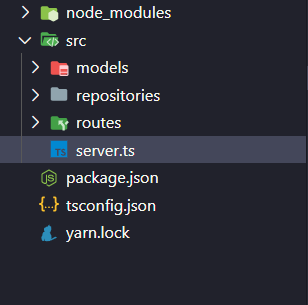

## Repositórios

É a conexão entre a persistência dos nossos dados e a nossa rota.  Geralmente uitiliza-se 1 repositório por model. 

Ao acessarmos uma rota, a mesma irá chamar algum método(create, list, find) lá no nosso repositório que então vai chamar o model que é responsável pela camada de persistência, seja no banco, em memória, arquivos, etc.. O repositório é quem detém as operações que serão realizadas nos dados da nossa aplicação, ou seja, ao armazenarmos qualquer tipo de dado, os repositórios serão utilizados para fazermos as operações nesses dados. 

Nesse formato o nosso model é quem possui os nossos dados, o repositório realiza as operações, e a rota vai ficando cada vez mais enxuta. Isto serve para desacloparmos nossa aplicação

<b>Persistência ↔ Repositório ↔ Rota</b>

### Criando um repositório

Primeiro vamos iniciar um projeto com typescript seguindo este tutorial [aqui](https://www.notion.so/TypeScript-f1c662b87120437e96964b87fc6a88c0). Após finalizado e com o seu server rodando vamos criar a estrutura de pastas.

Crie dentro da pasta src, os diretórios models, repositories e routes, deve ficar conforme abaixo

<div align="center">



</div>

Dentro da pasta routes, cries os arquivos index.ts e example.routes.ts com os conteúdos abaixo

```tsx
import { Router } from 'express'
import ExampleRoutes from '../routes/example.routes'

const routes = Router()

routes.use('/example', ExampleRoutes)

export default routes
```

```tsx
import { Router } from 'express'

import ExamplesRepository from '../repositories/ExampleRepository'

const exampleRoutes = Router()

const myExamples = new ExamplesRepository()

exampleRoutes.post('/', (request, response) => {
    const { examples, furtherData } = request.body

    const example = myExamples.create(examples, furtherData)

    return response.json(example)
})

export default exampleRoutes
```

Na pasta models crie o arquivo Example.ts

```tsx
class Examples {
    public examples: string

    public furtherData: string

    constructor(examples: string, furtherData: string) {
        this.examples = examples
        this.furtherData = furtherData
    }
}

export default Examples
```

E na pasta repositories crie o arquivo ExampleRepository.ts

```tsx
import Examples from '../models/Example'

class ExampleRepository {
    private examples: Examples[]

    constructor() {
        this.examples = []
    }

    public create(example: string, furtherData: string ): Examples {
        const examples = new Examples(example, furtherData)

        this.examples.push(examples)

        return examples
    }
}

export default ExampleRepository
```

Por fim, adicione no arquivo server.ts as configurações abaixo para testarmos a aplicação

```tsx
import express from 'express'

import routes from './routes'

const app = express()

// insira as configurações abaixo
app.use(express.json())
app.use(routes);

app.listen(3334, () => {
    console.log('🚀 Server is running on port 3334')
})
```

Pronto! Agora podemos testar a nossa aplicação via [Insomnia](https://insomnia.rest/) e ver que esta tudo funcionando.

<div align="center"> 

[](https://insomnia.rest/run/?label=Repositories%20Boilerplate%20&uri=https%3A%2F%2Fgithub.com%2Fmarcelogaldino%2Frepositories-boilerplate)

</div>